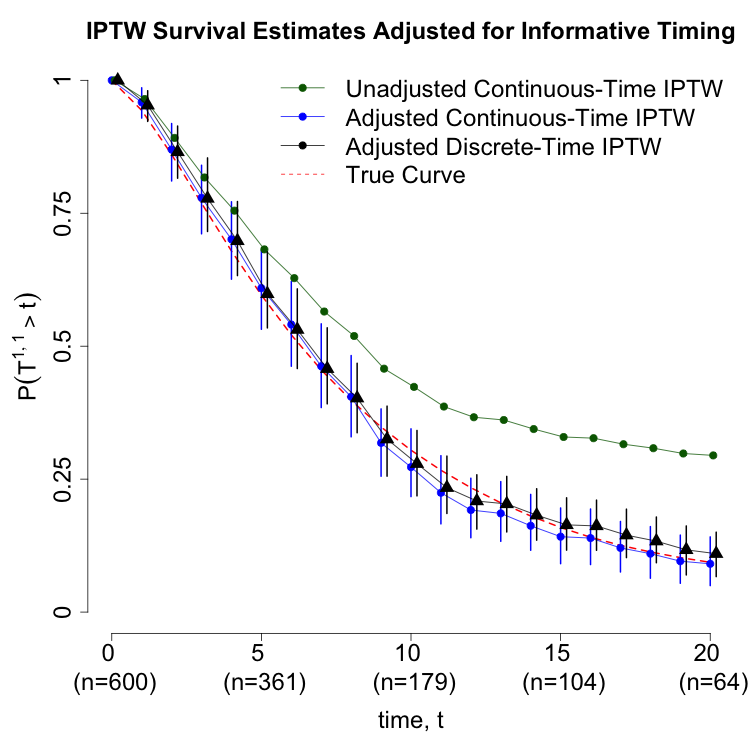

# Adjustment for Informative Timing

Companion repository for paper titled ``Considerations for Estimating Causal Effects of Informatively Timed Treatments.'' It contains example code illustrating adjustment for informatively timed sequence of two treatment decisions.

The main code to run is `example.R`. This takes as input the synthetic data set `simulated_data.Rdata` and runs continuous and discrete-time adjustment methods described in the paper. These methods are implemented in functions stored in `source_codes/function_source_code.R`.

The functions in `source_codes/function_source_code.R` are as follows:

- `sim_data`: simulates a data set of specified number of `n` patients moving through $K=2$ treatment courses. The data are simulated as described in Appendix A2. When argument `sim_true=TRUE', data are simulated under the intervention $(a_1=1, a_2=1)$ with no censoring in order to obtain a Monte Carlo approximation of the true survival time under this intervention.
- `run_iptw`: a function that takes as input a specified time point at which to compute survival rate and a data set, and implements the continuous-time IPTW adjustment in Section 3. When argument `adj=1`, waiting time since course 1 is adjusted for in the stage 2 propensity score model. When `adj=2`, the waiting time is left out (unadjusted for). The function `run_iptw_boot` is a wrapper for `run_iptw` which can be fed into the `boot::boot` bootstrap function to compute percentile 95\% intervals.
- `run_iptw_discrete`: a function that computes survival rates using the discrete-time version of `run_iptw` described in Section 5 of the paper. The function `run_iptw_discrete_boot` is a wrapper for `run_iptw_discrete` which can be fed into the `boot::boot` bootstrap function to compute percentile 95\% intervals.

When `example.R` finishes, it will output `.png` files from the manuscript - which match the ones provided in `manuscript_results/`:

